# The binding of Python


Hey, here is our binding project ! 
Linking python and our c++ backend, the binding allow you to program the engine using exposed functions. Unleash your creativity now !

## Building

To build the project, fist clone the repository.

```git clone git@gitlabstudents.isartintra.com:projets/2022_gp_2026_gp_2026python-scripting-tangui_alexandre_g_elliot.git```

And input the following command in git to initialise all submodules (pybind).

```git submodule update --init```

## Rapport de recherches

### Chosing between Pybind and Swig :

#### <ins>Swig :</ins>


To install Swig, you have to download it then put it in the Path in the parameter on your computer(in variable environment)


<ins>**How to use SWIG:**
  
Swig is easy to use and to build but it's a little difficult to setup, so let's go step by step.

**First**, you need to create a file.i where you tell which file is parsed with include..

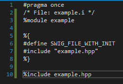

**Second**, you have to create a setup.py to use the distutils.

The distutils package provides support for building and installing additional modules into a Python installation.

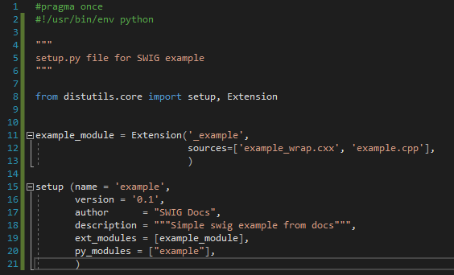

**Third**, you must build your extension with these commands just below.

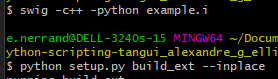

And finally, in cmd in python, you need to import your module and now, you’re free to use it.

  
Here is an example of a simple function factorial.
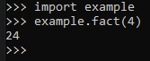


  

<ins>**Pros**:
- Easy to build, only 2 commands, and to import in python to use it.
- work not only with Python but other languages.

<ins>**Cons**:

- Need to wrap file by file

- It’s difficult to configure setup.py: you need to create a file.i per file.hpp and you have to add it in setup.py,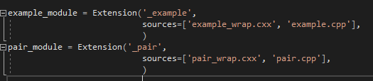

- **VERY IMPORTANT** : Swig does not allow us to execute python scripts in the c++ code. We need to use the inconvenient python library.


#### <ins>Pybind11 :</ins>
  
<ins>Exporting c++ is boring :</ins>

Exporting c++ code to python is a bit complicated. Let's first configure the project !

We need to generate a python module(a .pyd file) containing all the exported c++ ! And to do so, let’s create a second project, targeting a dll, in our vs studio solution, for this example it'll be named PybindTests. Now, building the solution will create a python module AND the engine itself !


  
Last but not least, don’t forget to set up post-build events in the vs project, to directly copy our new module in the engine !

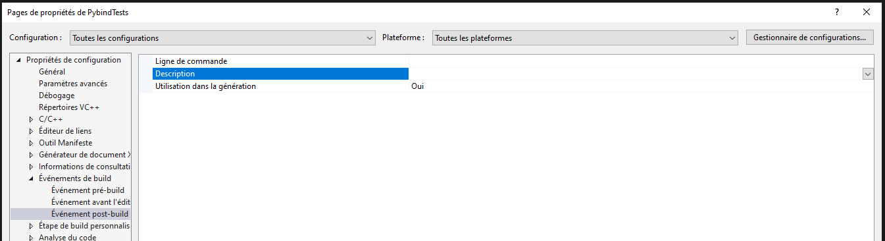

Now that the solution is setup, let's start to use pybind, and create our module !

To create a module using pybind, we'll use the macro provided by the lib

```c++
PYBIND11_MODULE(moduleName, m)
{
  //Definitions goes here
}
```

Where `moduleName` is the name of the module, and `m` the c++ object representing it for the definition.
Now, in between the brackets we can export our c++ code using the `def(functionName, functionPtr, functionDescription)` function of the module (`m`)
to export c++ functions.

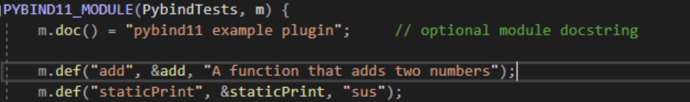

And `pybind11::class_<Class>(m, "ClassName")` function to export c++ classes like that :
Class methods are defined using `pybind11::class_::def()` function like normal functions.
And Attributes using a bunch of function :

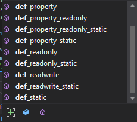

So, using all of this, we can export a class over to python !

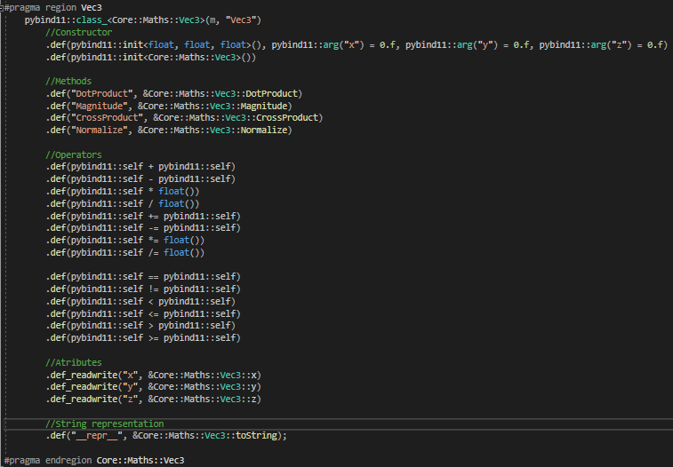
  
Optionally, we can also specify documentation for our module, by erasing the `m.doc()` value of the module :

```c++
m.doc() = "[EnginePy] : Python library to program \"The binding of python !\" Have fun !";
```

<ins>Executing python files is easy :</ins>

A cool feature of Pybind is that it allow us to embed the python interpreter using the lib. And thanks to that importing and using a python module in our c++ code can be done in only two lines !

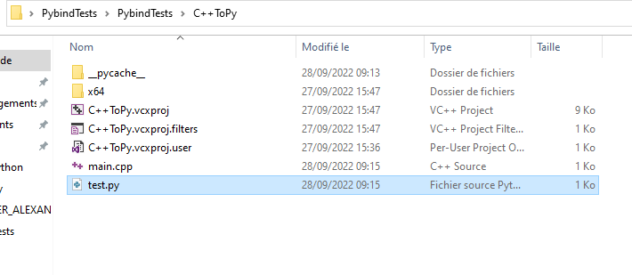

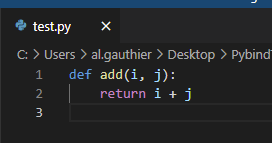  

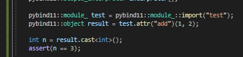  
  
  

And we can also reload modules at runtime using `pybind11::module_::reload()` method ! It's super useful !  

  
BUT Loading scripts this way can only be done with modules located in the working directory !


We may have to write a python startup script located on the working directory to add the possibility to load modules from another location !

```Python
#File : startup.py
import sys

sys.path.insert(1, 'path/to/script/folder')  #Carefull, path[0] is reserved !
```  

Great ! But what about the POO ?
Well, we can use the same kind of code to access python classes and methods in c++ !

Like for example,this “sus” class in test.py :

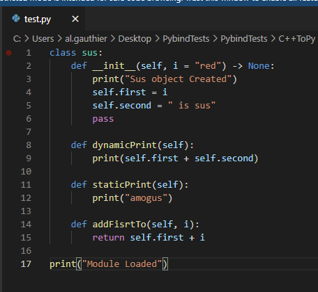

  

And this chunk of c++ code will output the following :

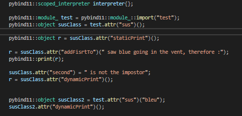

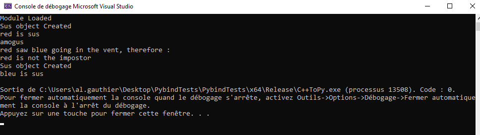  

<ins>**Pros :**</ins>

-   Loading and executing python files is so easy !
    
-   Every definition/export can be seen in our code. easy to troubleshoot.
    
-   We can tweak a lot of things, if we give the time it needs .
    

  

<ins>**Cons :**</ins>

-   Need to manually generate .pyd files alongside the engine -> Solution : Have a 2nd project in visual studio to automatically build a .pyd module.

-   Setting up the pyd project takes some time and may lead to human errors.

-   Exporting c++ code takes a significant amount of time.
    
 ### Conclusion :

Both solutions are complicated to setup.
But swig does not allow us to execute python modules directly in the c++ code, it's really inconvenient ! Plus, command based generation is not practicle in our case, it's way more easier using a second vs project.
And having to learn a new syntax to export code is going to take time, and a lot of trial and error.

So in our case, we'll use pybind for this porject !

### Implementing the technology in the engine :

Let's implement pybind in the engine !

#### <ins>EnginePy (python module) :</ins>
As described before, we've created a new project targeting a `.dll` in the visual solution :


And cloned pybind as a [git submodule](https://www.git-scm.com/book/en/v2/Git-Tools-Submodules) to use it and generate our python module.

```git submodule add https://github.com/cameronmcnz/submarines.git ./extern```

From there, we've defined the python module as described before and exported the following classes :

```
Core::Maths::Vec3

Core::Maths::Vec2

DataStructure::GameObject

LowRendrer::Camera

PlayerInputs
```

An exported class look like this, see [main.cpp](EnginePy/src/main.cpp) for all definitions.


We have now a cool python module with everything we need ! (And of course we can add more in the future).

#### <ins>It's engin' time ! :</ins>

To bridge python and the engine, we've used the embed features of pybind as described before.
But first things first, dont forget to add the pybind dependency the same way as for the module project ! (`git submodule`)

The (main) class of the engine, `App` ([see source](OpenGL/Headers/App.hpp)) now also contain the embeded python interpreter, allowing us to execute python everywhere we need to !

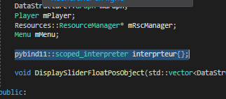

Now as we've said before, we can't import modules that aren't in the working directory, so let's code the `startup.py` script to init the python engine !

```python
#startup.py

/.../

currentDir :str = os.path.dirname(__file__)
userDir = currentDir + "\\Resources\\Scripts"
engineDir = currentDir + "\\Resources\\Scripts\\EnginePy"

/.../

sys.path.insert(1, userDir)   #Import modules from script folder
sys.path.insert(1, engineDir) #Built-in modules (EnginePy)

```

Great ! Running this script when we initialise the engine will allow the interpreter to load modules from the user directory ! 
`pybind11::module_::import("startup")`

To re-use the same architecture as the engine, let's create a new type of resource, the `Script` resource ! The main goal of this class is to encapsulate all we need to create and run a python script ! We assume that in the module there is a class with the same name, instantiate this class and update it each frame. See the [source](OpenGL/Headers/Resources/ScriptPy.hpp) for more infos.

Look at the player code now ! It's super small, thanks to python !

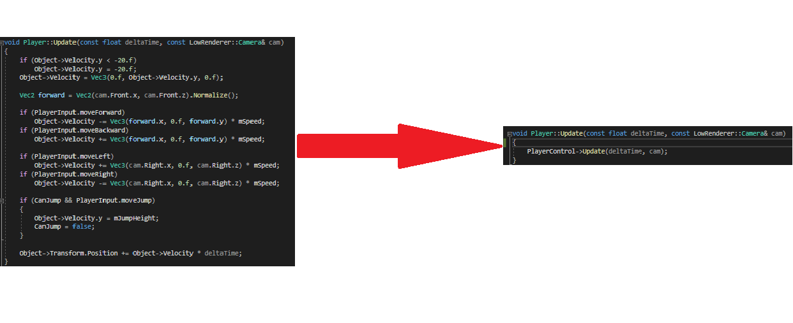

And that's it ! The player is now controlled from python !
